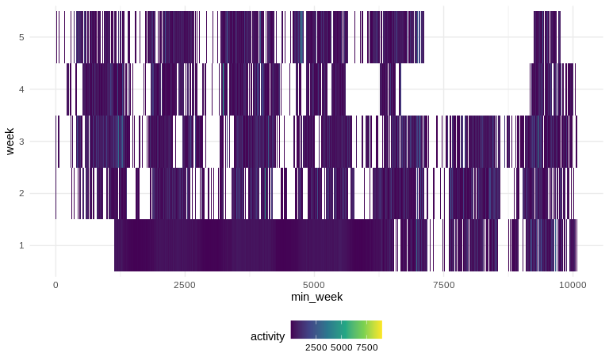

Untitled
================
Jeffrey Liang
10/02/2020

# Problem 1

``` r
library(p8105.datasets)
```

    ## Warning: package 'p8105.datasets' was built under R version 4.0.2

``` r
data("instacart")
```

# Problem 2

## Load data

``` r
accelerometer =
  read_csv(here::here("data/accel_data.csv")) %>% 
  janitor::clean_names() %>% 
  pivot_longer(
    cols = starts_with("activity_"),
    names_to = 'min',
    values_to = "activity",
    names_prefix = "activity_"
  ) %>% 
  mutate_at(c("min"),as.numeric) %>% 
  mutate(weekday_vs_weekend = day %in% c("Sunday","Saturday"),
         weekday_vs_weekend=
           case_when(weekday_vs_weekend ~"weekend",
                     !weekday_vs_weekend ~ "weekday") %>% 
           as.factor(),
         week = as.character(week) %>% forcats::fct_relevel(as.character(1:5)),
         day = forcats::fct_relevel(day,c("Monday","Tuesday","Wednesday","Thursday",
                                     "Friday", "Saturday","Sunday"))
         ) %>% 
  group_by(week) %>% 
  arrange(day,.by_group=T) %>% 
  mutate(min_week = 1, 
         min_week=cumsum(min_week),
         hour_week = min_week%/%60) %>% 
  ungroup() %>% 
  select(-day_id) %>% 
  left_join(
    distinct(.,week,day,) %>% 
      ungroup() %>% 
      mutate(day_id = 1,day_id = cumsum(day_id))
  )
```

    ## Parsed with column specification:
    ## cols(
    ##   .default = col_double(),
    ##   day = col_character()
    ## )

    ## See spec(...) for full column specifications.

    ## Joining, by = c("week", "day")

``` r
# TODO: day_id is not in order
str(accelerometer)
```

    ## tibble [50,400 × 8] (S3: tbl_df/tbl/data.frame)
    ##  $ week              : Factor w/ 5 levels "1","2","3","4",..: 1 1 1 1 1 1 1 1 1 1 ...
    ##  $ day               : Factor w/ 7 levels "Monday","Tuesday",..: 1 1 1 1 1 1 1 1 1 1 ...
    ##  $ min               : num [1:50400] 1 2 3 4 5 6 7 8 9 10 ...
    ##  $ activity          : num [1:50400] 1 1 1 1 1 1 1 1 1 1 ...
    ##  $ weekday_vs_weekend: Factor w/ 2 levels "weekday","weekend": 1 1 1 1 1 1 1 1 1 1 ...
    ##  $ min_week          : num [1:50400] 1 2 3 4 5 6 7 8 9 10 ...
    ##  $ hour_week         : num [1:50400] 0 0 0 0 0 0 0 0 0 0 ...
    ##  $ day_id            : num [1:50400] 1 1 1 1 1 1 1 1 1 1 ...

``` r
skimr::skim(accelerometer)
```

|                                                  |               |
| :----------------------------------------------- | :------------ |
| Name                                             | accelerometer |
| Number of rows                                   | 50400         |
| Number of columns                                | 8             |
| \_\_\_\_\_\_\_\_\_\_\_\_\_\_\_\_\_\_\_\_\_\_\_   |               |
| Column type frequency:                           |               |
| factor                                           | 3             |
| numeric                                          | 5             |
| \_\_\_\_\_\_\_\_\_\_\_\_\_\_\_\_\_\_\_\_\_\_\_\_ |               |
| Group variables                                  | None          |

Data summary

**Variable type: factor**

| skim\_variable       | n\_missing | complete\_rate | ordered | n\_unique | top\_counts                                |
| :------------------- | ---------: | -------------: | :------ | --------: | :----------------------------------------- |
| week                 |          0 |              1 | FALSE   |         5 | 1: 10080, 2: 10080, 3: 10080, 4: 10080     |
| day                  |          0 |              1 | FALSE   |         7 | Mon: 7200, Tue: 7200, Wed: 7200, Thu: 7200 |
| weekday\_vs\_weekend |          0 |              1 | FALSE   |         2 | wee: 36000, wee: 14400                     |

**Variable type: numeric**

| skim\_variable | n\_missing | complete\_rate |    mean |      sd | p0 |     p25 |    p50 |     p75 |  p100 | hist  |
| :------------- | ---------: | -------------: | ------: | ------: | -: | ------: | -----: | ------: | ----: | :---- |
| min            |          0 |              1 |  720.50 |  415.70 |  1 |  360.75 |  720.5 | 1080.25 |  1440 | ▇▇▇▇▇ |
| activity       |          0 |              1 |  267.04 |  443.16 |  1 |    1.00 |   74.0 |  364.00 |  8982 | ▇▁▁▁▁ |
| min\_week      |          0 |              1 | 5040.50 | 2909.87 |  1 | 2520.75 | 5040.5 | 7560.25 | 10080 | ▇▇▇▇▇ |
| hour\_week     |          0 |              1 |   83.52 |   48.50 |  0 |   42.00 |   84.0 |  126.00 |   168 | ▇▇▇▇▇ |
| day\_id        |          0 |              1 |   18.00 |   10.10 |  1 |    9.00 |   18.0 |   27.00 |    35 | ▇▇▇▇▇ |

 The original data is a “wider” format data with 35 x 1443 dimension. In
order to make the data compatible with machine, pivot\_long() is used to
make the *activity*\*\_ of all subjects into columns of *min and
activity*. Following instruction, weekend vs weekday’s variable is build
on *day\_id* and result into a 50400 x 8 dataset.

  - Traditional analyses of accelerometer data focus on the total
    activity over the day. Using your tidied dataset, aggregate accross
    minutes to create a total activity variable for each day, and create
    a table showing these totals. Are any trends apparent?

<!-- end list -->

``` r
accelerometer %>% 
  group_by(day_id) %>% 
  summarise(daily_activity = sum(activity,na.rm=T)) %>% 
  knitr::kable()
```

    ## `summarise()` ungrouping output (override with `.groups` argument)

| day\_id | daily\_activity |
| ------: | --------------: |
|       1 |        78828.07 |
|       2 |       307094.24 |
|       3 |       340115.01 |
|       4 |       355923.64 |
|       5 |       480542.62 |
|       6 |       376254.00 |
|       7 |       631105.00 |
|       8 |       295431.00 |
|       9 |       423245.00 |
|      10 |       440962.00 |
|      11 |       474048.00 |
|      12 |       568839.00 |
|      13 |       607175.00 |
|      14 |       422018.00 |
|      15 |       685910.00 |
|      16 |       381507.00 |
|      17 |       468869.00 |
|      18 |       371230.00 |
|      19 |       467420.00 |
|      20 |       382928.00 |
|      21 |       467052.00 |
|      22 |       409450.00 |
|      23 |       319568.00 |
|      24 |       434460.00 |
|      25 |       340291.00 |
|      26 |       154049.00 |
|      27 |         1440.00 |
|      28 |       260617.00 |
|      29 |       389080.00 |
|      30 |       367824.00 |
|      31 |       445366.00 |
|      32 |       549658.00 |
|      33 |       620860.00 |
|      34 |         1440.00 |
|      35 |       138421.00 |

``` r
# TODO: hwo to make this table clean and nice? definatly not janitor, this is continuous
```

  - Accelerometer data allows the inspection activity over the course of
    the day. Make a single-panel plot that shows the 24-hour activity
    time courses for each day and use color to indicate day of the week.
    Describe in words any patterns or conclusions you can make based on
    this graph. Problem 3

<!-- end list -->

``` r
accelerometer %>% 
  filter(activity>1) %>% 
  group_by(week,day_id,hour_week) %>% 
  summarise(activity_hr = sum(activity,na.rm=T)) %>% 
  ggplot(aes(x=hour_week,y=activity_hr,color=week))+
  geom_point(alpha = 0.5)+
  geom_smooth(se=F,method = 'gam' )+
  geom_line()+
  scale_y_continuous(trans = "log")
```

    ## `summarise()` regrouping output by 'week', 'day_id' (override with `.groups` argument)

    ## `geom_smooth()` using formula 'y ~ s(x, bs = "cs")'


``` r
accelerometer %>% 
  filter(activity>1) %>% 
  ggplot(aes(x=min_week,y=week,fill=activity))+
  geom_tile(size=1.5, stat="identity")
```



``` r
# How to decently present the data in here?
#try plotly
hmp = 
  accelerometer %>% 
  group_by(hour_week,week,day) %>% 
  summarise(activity = sum(activity)) %>% 
  select(week,day,activity,hour_week) %>% 
  plotly::plot_ly(x=~hour_week,y=~week,z=~activity,type="heatmap",
                  colors = viridis::viridis_pal(option ="B")(3),
                  height = 3, width = 1500,
                  hoverinfo = 'text', 
                  text = ~paste("Hour:",.$hour_week,
                                "Week:",pull(.,week),
                                "Activity:",pull(.,activity)
                               ))
```

    ## `summarise()` regrouping output by 'hour_week', 'week' (override with `.groups` argument)

# Problem 3

``` r
data("ny_noaa")
tryCatch(
  {ny_noaa_tidy = read_csv(here::here("data/ny_noaa_tidy.csv"))},
  error ={
    ny_noaa_tidy = ny_noaa %>% 
    separate(date,
             into=c("year","month","day"),sep="-") %>%
    mutate(across(year:tmin,as.numeric)) %>% 
    mutate(
      snow = case_when(
      snow <0 ~0))
  write_csv(ny_noaa_tidy,here::here("data/ny_noaa_tidy.csv"))})
skimr::skim(ny_noaa_tidy)
```

  - Make a two-panel plot showing the average max temperature in January
    and in July in each station across years. Is there any observable /
    interpretable structure? Any outliers?

<!-- end list -->

``` r
ny_noaa_tidy %>% 
  filter(as.numeric(month) %in% c(1,7)) %>% 
  mutate(day = as.factor(day),
         month = month.name[month]) %>% 
  ggplot(aes(x = day, y = tmax, color = month)) +
  geom_boxplot(outlier.size = 0.5,
               outlier.alpha = 0.5)+
  #scale_color_viridis_d(option = "E",name = "Month")+
  facet_wrap(.~month,ncol = 1)+
  scale_y_continuous(position = "right",
                     name = "Highest Temperature of the Day")+
  scale_x_discrete(breaks = seq(1,31,5),
                   name = "Day of Month")
```
