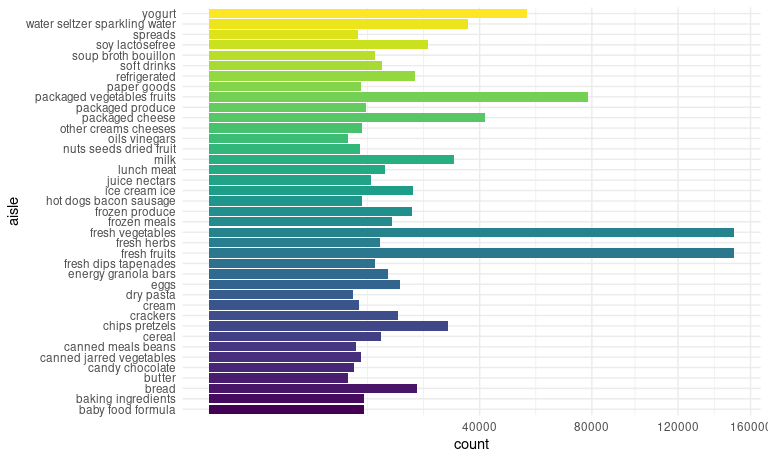
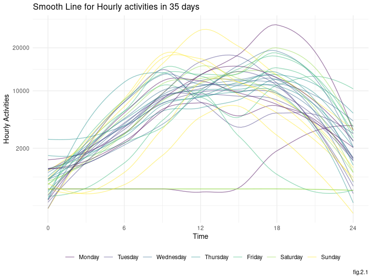
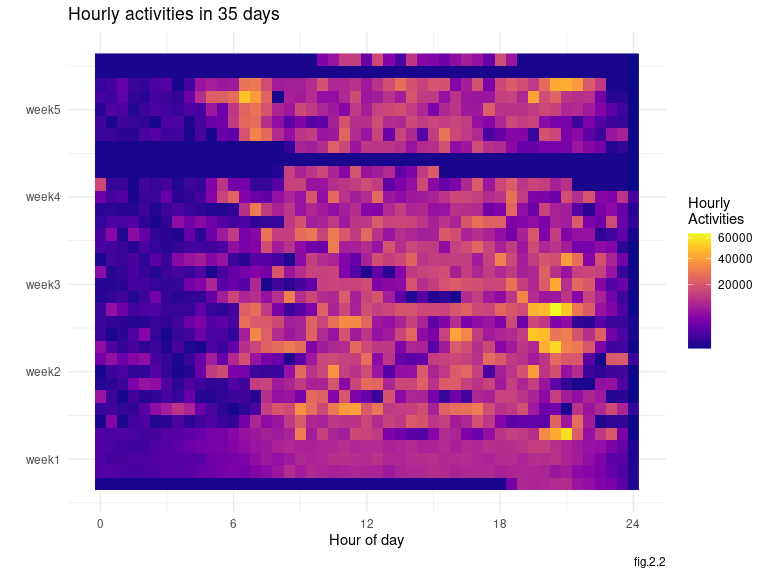
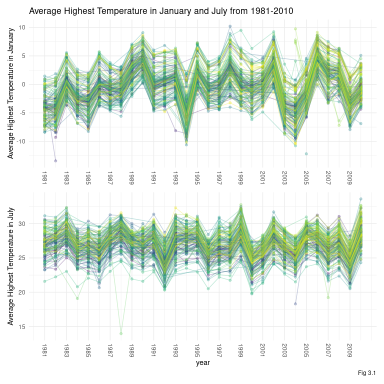
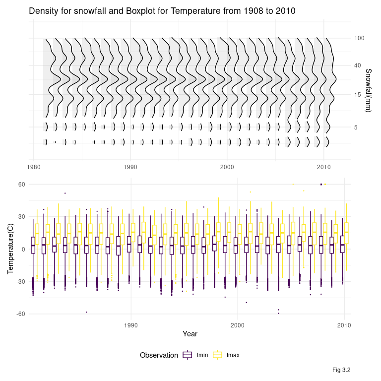

P8105\_hw3\_zl2974
================
Jeffrey Liang
10/02/2020

# Problem 1

``` r
data("instacart")
instacart %>% 
  count(aisle,name = "n_count") %>% 
  arrange(desc(n_count))
```

    ## # A tibble: 134 x 2
    ##    aisle                         n_count
    ##    <chr>                           <int>
    ##  1 fresh vegetables               150609
    ##  2 fresh fruits                   150473
    ##  3 packaged vegetables fruits      78493
    ##  4 yogurt                          55240
    ##  5 packaged cheese                 41699
    ##  6 water seltzer sparkling water   36617
    ##  7 milk                            32644
    ##  8 chips pretzels                  31269
    ##  9 soy lactosefree                 26240
    ## 10 bread                           23635
    ## # … with 124 more rows

``` r
instacart %>% 
  group_by(aisle) %>% 
  filter(n()>1e+4) %>%
  mutate(counts = n()) %>% 
  ungroup() %>% 
  mutate(aisle = 
           forcats::fct_reorder(aisle,counts)) %>% 
  ggplot(aes(y = aisle,fill = aisle)) +
  geom_bar()+
  scale_x_continuous(trans = "sqrt")+
  theme(legend.position = "none")
```

<!-- -->

``` r
for (aisle_ in c("baking ingredients","dog food care","packaged vegetables fruits")){
instacart %>% 
  filter(aisle %in% c(aisle_)) %>%
  count(aisle,product_name) %>% 
  slice_max(n,n=3) %>% #or use mutate(rank = min_rank(desc(n)))
  left_join(instacart) %>% 
    janitor::tabyl(aisle,product_name) %>% 
    print()
}
```

    ##               aisle Cane Sugar Light Brown Sugar Pure Baking Soda
    ##  baking ingredients        336               499              387
    ##          aisle Organix Chicken & Brown Rice Recipe Small Dog Biscuits
    ##  dog food care                                  28                 26
    ##  Snack Sticks Chicken & Rice Recipe Dog Treats
    ##                                             30
    ##                       aisle Organic Baby Spinach Organic Blueberries
    ##  packaged vegetables fruits                 9784                4966
    ##  Organic Raspberries
    ##                 5546

``` r
instacart %>% 
  filter(product_name %in% c("Pink Lady Apples","Coffee Ice Cream")) %>% 
  group_by(product_name,order_dow) %>% 
  summarise(avg_order_hour_of_day = mean(order_hour_of_day,na.rm = T)) %>% 
  pivot_wider(names_from = order_dow,
              names_prefix = "avg_order_hour_of_day_week_",
              values_from = avg_order_hour_of_day) %>% 
  ungroup() %>% 
  t()
```

    ##                              [,1]               [,2]              
    ## product_name                 "Coffee Ice Cream" "Pink Lady Apples"
    ## avg_order_hour_of_day_week_0 "13.8"             "13.4"            
    ## avg_order_hour_of_day_week_1 "14.3"             "11.4"            
    ## avg_order_hour_of_day_week_2 "15.4"             "11.7"            
    ## avg_order_hour_of_day_week_3 "15.3"             "14.2"            
    ## avg_order_hour_of_day_week_4 "15.2"             "11.6"            
    ## avg_order_hour_of_day_week_5 "12.3"             "12.8"            
    ## avg_order_hour_of_day_week_6 "13.8"             "11.9"

# Problem 2

## Load data

``` r
accelerometer =
  read_csv(here::here("data/accel_data.csv")) %>% 
  janitor::clean_names() %>% 
  pivot_longer(
    cols = starts_with("activity_"),
    names_to = 'min',
    values_to = "activity",
    names_prefix = "activity_"
  ) %>% 
  mutate_at(c("min"),as.numeric) %>% 
  mutate(weekday_vs_weekend = day %in% c("Sunday","Saturday"),
         weekday_vs_weekend=
           case_when(weekday_vs_weekend ~"weekend",
                     !weekday_vs_weekend ~ "weekday") %>% 
           as.factor(),
         week = as.character(week) %>%
           forcats::fct_relevel(as.character(1:5)),
         day = forcats::fct_relevel(day,
                                    c("Monday","Tuesday","Wednesday","Thursday",
                                     "Friday", "Saturday","Sunday"))
         ) %>% 
  group_by(week) %>% 
  arrange(day,.by_group=T) %>% 
  group_by(day_id) %>% 
  mutate(min_week = 1,
         hour_day = 
           cumsum(min_week)%/%30/2) %>% 
  ungroup(day_id) %>% 
  mutate(min_week=
           cumsum(min_week),
         hour_week =
           min_week%/%30/2) %>% 
  ungroup() %>% 
  select(-day_id) %>% 
  left_join(
    distinct(.,week,day,) %>% 
      ungroup() %>% 
      mutate(day_id = 1,
             day_id = cumsum(day_id))
  )

skimr::skim_without_charts(accelerometer)
```

|                                                  |               |
| :----------------------------------------------- | :------------ |
| Name                                             | accelerometer |
| Number of rows                                   | 50400         |
| Number of columns                                | 9             |
| \_\_\_\_\_\_\_\_\_\_\_\_\_\_\_\_\_\_\_\_\_\_\_   |               |
| Column type frequency:                           |               |
| factor                                           | 3             |
| numeric                                          | 6             |
| \_\_\_\_\_\_\_\_\_\_\_\_\_\_\_\_\_\_\_\_\_\_\_\_ |               |
| Group variables                                  | None          |

Data summary

**Variable type: factor**

| skim\_variable       | n\_missing | complete\_rate | ordered | n\_unique | top\_counts                                |
| :------------------- | ---------: | -------------: | :------ | --------: | :----------------------------------------- |
| week                 |          0 |              1 | FALSE   |         5 | 1: 10080, 2: 10080, 3: 10080, 4: 10080     |
| day                  |          0 |              1 | FALSE   |         7 | Mon: 7200, Tue: 7200, Wed: 7200, Thu: 7200 |
| weekday\_vs\_weekend |          0 |              1 | FALSE   |         2 | wee: 36000, wee: 14400                     |

**Variable type: numeric**

| skim\_variable | n\_missing | complete\_rate |    mean |       sd | p0 |   p25 |   p50 |   p75 |  p100 |
| :------------- | ---------: | -------------: | ------: | -------: | -: | ----: | ----: | ----: | ----: |
| min            |          0 |              1 |   720.5 |   415.70 |  1 |   361 |   720 |  1080 |  1440 |
| activity       |          0 |              1 |   267.0 |   443.16 |  1 |     1 |    74 |   364 |  8982 |
| min\_week      |          0 |              1 | 25200.5 | 14549.37 |  1 | 12601 | 25200 | 37800 | 50400 |
| hour\_day      |          0 |              1 |    11.8 |     6.93 |  0 |     6 |    12 |    18 |    24 |
| hour\_week     |          0 |              1 |   419.8 |   242.49 |  0 |   210 |   420 |   630 |   840 |
| day\_id        |          0 |              1 |    18.0 |    10.10 |  1 |     9 |    18 |    27 |    35 |

 The original data is a “wider” format data with 35 x 1443 dimension. In
order to make the data compatible with machine, pivot\_long() is used to
make the *activity*\*\_ of all subjects into columns of *min and
activity*. Following instruction, weekend vs weekday’s variable is built
on *day* and producing factor columns with levels of weekday, weekend.
With careful examine, the *day\_id*’s order is not correct, a new column
of *day\_id* follow chronological order generated with *week* and
reordered factors *day*. Also for convenient, *hour* of the day and
*hour\_week* of the week were produced with cumsum() function. All
changes resulted the data into a 50400 x 9 dataset.

  - Traditional analyses of accelerometer data focus on the total
    activity over the day. Using your tidied dataset, aggregate accross
    minutes to create a total activity variable for each day, and create
    a table showing these totals. Are any trends apparent?

<!-- end list -->

``` r
accelerometer %>% 
  group_by(week,day) %>% 
  summarise(daily_activity = sum(activity,na.rm=T)) %>% 
  pivot_wider(names_from = week,
              names_prefix = "week ",
              values_from = daily_activity) %>% 
  knitr::kable()
```

| day       | week 1 | week 2 | week 3 | week 4 | week 5 |
| :-------- | -----: | -----: | -----: | -----: | -----: |
| Monday    |  78828 | 295431 | 685910 | 409450 | 389080 |
| Tuesday   | 307094 | 423245 | 381507 | 319568 | 367824 |
| Wednesday | 340115 | 440962 | 468869 | 434460 | 445366 |
| Thursday  | 355924 | 474048 | 371230 | 340291 | 549658 |
| Friday    | 480543 | 568839 | 467420 | 154049 | 620860 |
| Saturday  | 376254 | 607175 | 382928 |   1440 |   1440 |
| Sunday    | 631105 | 422018 | 467052 | 260617 | 138421 |

 A 7 by 5 table is produced. Noticing that the subject had 2 exceptional
low activity on Saturday on week 4 and 5 inmediately.

  - Accelerometer data allows the inspection activity over the course of
    the day. Make a single-panel plot that shows the 24-hour activity
    time courses for each day and use color to indicate day of the week.
    Describe in words any patterns or conclusions you can make based on
    this graph.

<!-- end list -->

``` r
accelerometer %>% 
  group_by(day_id,day,hour_day) %>% 
  summarise(activity_hr = 
              sum(activity,na.rm=T)) %>% 
  ggplot(aes(x=hour_day,
             y= activity_hr,
             color = day,
             group = day_id))+
  stat_smooth(se = F,
              method = "loess",
              geom="line",
              alpha =0.5)+
  scale_y_continuous(trans = "sqrt",
                     name = "Hourly Activities",
                     breaks = c(2000,10000,20000))+
  scale_x_continuous(name = "Time",
                     limits = c(0,24),
                     breaks = seq(0,24,6))+
  viridis::scale_color_viridis(discrete = T,
                               name = "")+
  guides(color=guide_legend(nrow=1,
                            byrow=TRUE))+
  labs(
    title = "Smooth Line for Hourly activities in 35 days",
    caption = "fig.2.1"
  )
```

<!-- -->

 A smooth line plot of 24hr activities is made, most of the lines are
overlapping indicate some general pattern of the subject’s daily
routine: activities peak after 8 am and start decreasing after 6 pm. Few
outliers were observed as well, some Saturday’s activities are
unfluctuated, and some sunday’s activities and monday’s as well as
Friday’s peak later than the most of other days’.

``` r
accelerometer %>% 
  group_by(week,day_id,hour_day) %>% 
  summarise(activity_hr = 
              sum(activity,na.rm=T)) %>% 
  ggplot(aes(x=hour_day,
             y=day_id,
             fill=activity_hr))+
  geom_raster(stat="identity")+
  scale_y_continuous(breaks = seq(3,31,7),
                   labels = c(str_c("week",c(1:5))),
                   position = "left",
                   name = '')+
  scale_x_continuous(breaks = seq(0,24,6),
                     name = "Hour of day")+
  theme(legend.position = "right")+
  viridis::scale_fill_viridis(option = "C",
                              name = "Hourly\nActivities",
                              trans = "sqrt")+
  labs(
    title = "Hourly activities in 35 days",
    caption = "fig.2.2"
  )
```

<!-- -->

 To display more information, a heatmap is made. In Week 1, the first
few days show less changes in activities between hour compared to the
following weeks, especially the first day of week 1, the researcher can
look into if the subject have the equipment gear up properly. In the
following weeks, subject has his/her first peek of activities around
6-10, and following the second peek around 20. The activities on
Saturday on week 4 and 5 show no changes in the heatmap, coherent with
the finding in 7 by 5 table. The sunday in weeks 4 and 5 and the Firday
in week 4 show less activities, accordinates with the outliers displayed
in Fig.2.2.

# Problem 3

``` r
data("ny_noaa")
ny_noaa_tidy = ny_noaa %>% 
    separate(date,
             into=c("year","month","day"),sep="-",
             remove = F) %>%
    mutate(across(year:tmin,as.numeric),
           across(tmax:tmin,function(x) x/10)) %>% 
    mutate(
      snow = case_when(
      snow <0 ~0,
      snow >= 0 ~snow))
    
skimr::skim_without_charts(ny_noaa_tidy %>% select(-id))
```

|                                                  |                               |
| :----------------------------------------------- | :---------------------------- |
| Name                                             | ny\_noaa\_tidy %\>% select(-… |
| Number of rows                                   | 2595176                       |
| Number of columns                                | 9                             |
| \_\_\_\_\_\_\_\_\_\_\_\_\_\_\_\_\_\_\_\_\_\_\_   |                               |
| Column type frequency:                           |                               |
| Date                                             | 1                             |
| numeric                                          | 8                             |
| \_\_\_\_\_\_\_\_\_\_\_\_\_\_\_\_\_\_\_\_\_\_\_\_ |                               |
| Group variables                                  | None                          |

Data summary

**Variable type: Date**

| skim\_variable | n\_missing | complete\_rate | min        | max        | median     | n\_unique |
| :------------- | ---------: | -------------: | :--------- | :--------- | :--------- | --------: |
| date           |          0 |              1 | 1981-01-01 | 2010-12-31 | 1997-01-21 |     10957 |

**Variable type: numeric**

| skim\_variable | n\_missing | complete\_rate |    mean |     sd |     p0 |    p25 |    p50 |    p75 |  p100 |
| :------------- | ---------: | -------------: | ------: | -----: | -----: | -----: | -----: | -----: | ----: |
| year           |          0 |           1.00 | 1996.50 |   9.19 | 1981.0 | 1988.0 | 1997.0 | 2005.0 |  2010 |
| month          |          0 |           1.00 |    6.56 |   3.45 |    1.0 |    4.0 |    7.0 |   10.0 |    12 |
| day            |          0 |           1.00 |   15.73 |   8.80 |    1.0 |    8.0 |   16.0 |   23.0 |    31 |
| prcp           |     145838 |           0.94 |   29.82 |  78.18 |    0.0 |    0.0 |    0.0 |   23.0 | 22860 |
| snow           |     381221 |           0.85 |    4.99 |  27.22 |    0.0 |    0.0 |    0.0 |    0.0 | 10160 |
| snwd           |     591786 |           0.77 |   37.31 | 113.54 |    0.0 |    0.0 |    0.0 |    0.0 |  9195 |
| tmax           |    1134358 |           0.56 |   13.98 |  11.14 | \-38.9 |    5.0 |   15.0 |   23.3 |    60 |
| tmin           |    1134420 |           0.56 |    3.03 |  10.40 | \-59.4 |  \-3.9 |    3.3 |   11.1 |    60 |

 The data of NYC’s noaa is a tidy 2595176x 10 data in term’s of
structure, collecting data from 1981-01-01 to 2010-12-31 of 747
stations. But missing value in *tmax* and *tmin* have exceed 40% and
around 20% in *prcp* and *snow* columns, in other words, simplily
omitting NA will drop at least 40% of the data. Impossible outlier is
observed in *snow*, which most common observation is 0 after omitting Na
value, which can be interpret as no snow in that day. Across 3 decades,
the mean of highest temperature is 14.0 celcious and mean lowest of 3.03
celcious.

  - Make a two-panel plot showing the average max temperature in January
    and in July in *each station* across years. Is there any observable
    / interpretable structure? Any outliers?

<!-- end list -->

``` r
plt_1 = 
ny_noaa_tidy %>% 
  filter(as.numeric(month) %in% c(1)) %>% 
  group_by(month,year,id) %>% 
  summarise(tmax_avg = mean(tmax,na.rm = T)) %>% 
  mutate(rank  = min_rank(desc(tmax_avg))
         ) %>%
  drop_na() %>% 
  ggplot(aes(x = year,
             y = tmax_avg,
             color = id,
             group = id))+
  geom_point(alpha = 0.3)+
  geom_path(alpha = 0.3)+
  theme(legend.position = 'none',
        axis.title.x = element_blank())+
  scale_x_continuous(breaks = seq(1981,2010,2),
                     limits = c(1981,2010))+
  theme(axis.text.x = element_text(angle = -90,
                                   vjust = 0.5,
                                   hjust = 1))+
  labs(title = "Average Highest Temperature in January and July from 1981-2010",
       y = "Average Highest Temperature in January")

plt_2 =
  ny_noaa_tidy %>% 
  filter(as.numeric(month) %in% c(7)) %>% 
  group_by(month,year,id) %>% 
  summarise(tmax_avg = mean(tmax,na.rm = T)) %>% 
  mutate(rank  = min_rank(desc(tmax_avg))
         ) %>%
  drop_na() %>% 
  ggplot(aes(x = year,
             y = tmax_avg,
             color = id,
             group = id))+
  geom_point(alpha = 0.3)+
  geom_path(alpha = 0.3)+
  theme(legend.position = 'none')+
  labs(y = "Average Highest Temperature in July")+
  scale_x_continuous(breaks = seq(1981,2010,2),
                     limits = c(1981,2010))+
  theme(axis.text.x = element_text(angle = -90,
                                   vjust = 0.5,
                                   hjust = 1))

plt_1 / plt_2
```

<!-- -->

 January’s average Highest temperatures observed in NYC across all
stations differs around 10 degrees across the time. Two exceptional cold
years in terms of highest temperature are observed in all station in
1994 and 2004 .  Mean Highest temperatures in July flucturate arond 20
to 30, the measure difference across stations is similar to January. 2
lower and 3 upper outliers were observed in January in 3 decades, 8
lower outliers were observed in July.

``` r
plt_1 = 
ny_noaa_tidy %>%
    pivot_longer(
      tmax:tmin,
      names_to = "observation",
      values_to = "temperature"
    ) %>% 
    mutate(observation = forcats::fct_relevel(observation,c("tmin","tmax"))) %>% 
    ggplot(aes(x = as.factor(year), y = temperature, color = observation))+
    geom_boxplot(outlier.size = 0.2)+
    scale_x_discrete(breaks = seq(1981,2010,1),
                     name = "Year")+
    viridis::scale_color_viridis(discrete = T,
                                 option = "D",
                                 name = "Observation")+
    labs(y = "Temperature(C)",
         caption = "Fig 3.2")+
    theme(axis.text.x = element_text(angle = -90,
                                     vjust = 0.5,
                                     hjust = 1))

plt_2 = 
ny_noaa_tidy %>% 
  filter(between(snow,1,100),
         !is.na(snow)) %>% 
  ggplot(aes(x= snow))+
  geom_density_ridges(aes(y = year,
                          group = as.factor(year)),
                          alpha = 0.2,
                      rel_min_height = 0.15)+
  theme(axis.title.x = element_blank(),
        axis.text.x = element_text(angle = -90,
                                   vjust = 0.5,
                                   size = 8,
                                   hjust = 1))+
  scale_x_continuous(trans = "log",
                     breaks = c(5, 15,40, 100))+
  scale_y_continuous(breaks = seq(1981,2010,1),
                     limits = c(1981,NA))+
  coord_flip()+
  labs(title = "Density for snowfall and Boxplot for Temperature from 1908 to 2010",
       x = "Snowfall(mm)")

(plt_2 / plt_1)+ plot_layout(guides = 'collect',widths = 8, heights = 16)
```

<!-- -->

 Grouped Boxplot is used to show pattern and extreme tempertures in the
whole dataset. Although mean and IQR of the lowest and highest
temperatures haven’t showed any sign of global warming, extreme lowest
temperature is occurring less often in 2000s compared to before 2000.
Density ridges with flipped coordinate is use to show snowfall pattern.
The kernel density becomes flatten in 2009 and 2010. Also, light
snowfall(\<=10 mm) is taking higher proportion of total snowfall. So,
some evidence favor the theorem of global warming might lying in this
data.
