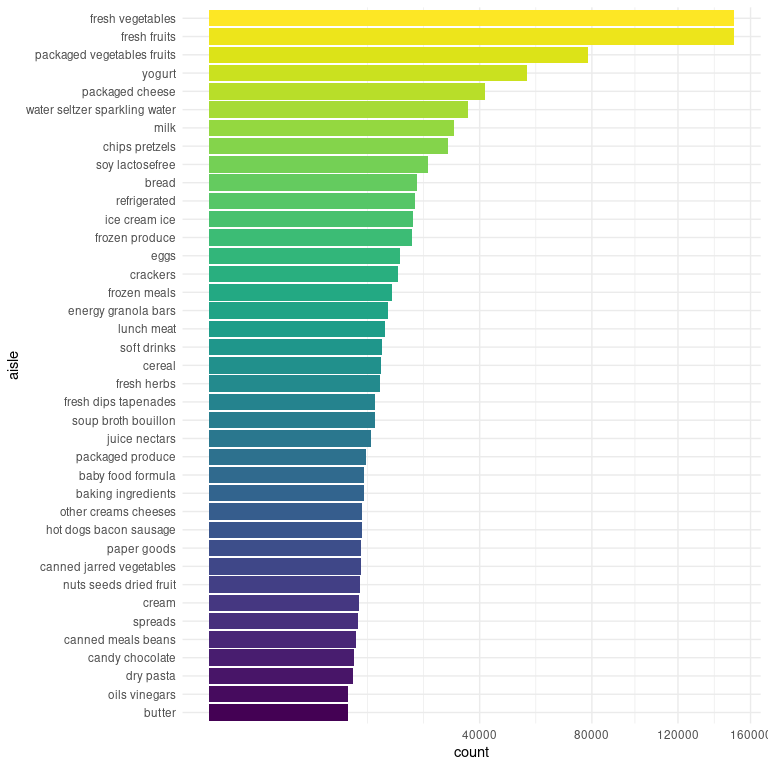
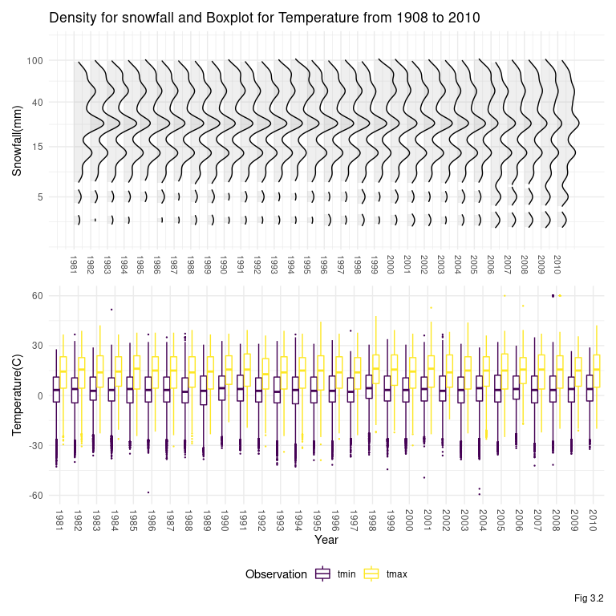

P8105\_hw3\_zl2974
================
Jeffrey Liang
10/02/2020

# Problem 1

``` r
library(p8105.datasets)
data("instacart")
```

``` r
instacart %>% 
  count(aisle,name = "n_count") %>% 
  arrange(desc(n_count))
```

    ## # A tibble: 134 x 2
    ##    aisle                         n_count
    ##    <chr>                           <int>
    ##  1 fresh vegetables               150609
    ##  2 fresh fruits                   150473
    ##  3 packaged vegetables fruits      78493
    ##  4 yogurt                          55240
    ##  5 packaged cheese                 41699
    ##  6 water seltzer sparkling water   36617
    ##  7 milk                            32644
    ##  8 chips pretzels                  31269
    ##  9 soy lactosefree                 26240
    ## 10 bread                           23635
    ## # … with 124 more rows

``` r
instacart %>% 
  group_by(aisle) %>% 
  filter(n()>1e+4) %>%
  mutate(counts = n()) %>% 
  ungroup() %>% 
  mutate(aisle = 
           forcats::fct_reorder(aisle,counts)) %>% 
  ggplot(aes(y = aisle,fill = aisle)) +
  geom_bar()+
  scale_x_continuous(trans = "sqrt")+
  theme(legend.position = "none")
```

<!-- -->

``` r
for (aisle_ in c("baking ingredients","dog food care","packaged vegetables fruits")){
instacart %>% 
  filter(aisle %in% c(aisle_)) %>%
  count(aisle,product_name) %>% 
  slice_max(n,n=3) %>% #or use mutate(rank = min_rank(desc(n)))
  left_join(instacart) %>% 
    janitor::tabyl(aisle,product_name) %>% 
    print()
}
```

    ##               aisle Cane Sugar Light Brown Sugar Pure Baking Soda
    ##  baking ingredients        336               499              387
    ##          aisle Organix Chicken & Brown Rice Recipe Small Dog Biscuits
    ##  dog food care                                  28                 26
    ##  Snack Sticks Chicken & Rice Recipe Dog Treats
    ##                                             30
    ##                       aisle Organic Baby Spinach Organic Blueberries
    ##  packaged vegetables fruits                 9784                4966
    ##  Organic Raspberries
    ##                 5546

``` r
instacart %>% 
  filter(product_name %in% c("Pink Lady Apples","Coffee Ice Cream")) %>% 
  group_by(product_name,order_dow) %>% 
  summarise(avg_order_hour_of_day = mean(order_hour_of_day,na.rm = T)) %>% 
  pivot_wider(names_from = order_dow,
              names_prefix = "avg_order_hour_of_day_week_",
              values_from = avg_order_hour_of_day) %>% 
  ungroup() %>% 
  t()
```

    ##                              [,1]               [,2]              
    ## product_name                 "Coffee Ice Cream" "Pink Lady Apples"
    ## avg_order_hour_of_day_week_0 "13.77419"         "13.44118"        
    ## avg_order_hour_of_day_week_1 "14.31579"         "11.36000"        
    ## avg_order_hour_of_day_week_2 "15.38095"         "11.70213"        
    ## avg_order_hour_of_day_week_3 "15.31818"         "14.25000"        
    ## avg_order_hour_of_day_week_4 "15.21739"         "11.55172"        
    ## avg_order_hour_of_day_week_5 "12.26316"         "12.78431"        
    ## avg_order_hour_of_day_week_6 "13.83333"         "11.93750"

# Problem 2

## Load data

``` r
accelerometer =
  read_csv(here::here("data/accel_data.csv")) %>% 
  janitor::clean_names() %>% 
  pivot_longer(
    cols = starts_with("activity_"),
    names_to = 'min',
    values_to = "activity",
    names_prefix = "activity_"
  ) %>% 
  mutate_at(c("min"),as.numeric) %>% 
  mutate(weekday_vs_weekend = day %in% c("Sunday","Saturday"),
         weekday_vs_weekend=
           case_when(weekday_vs_weekend ~"weekend",
                     !weekday_vs_weekend ~ "weekday") %>% 
           as.factor(),
         week = as.character(week) %>% forcats::fct_relevel(as.character(1:5)),
         day = forcats::fct_relevel(day,c("Monday","Tuesday","Wednesday","Thursday",
                                     "Friday", "Saturday","Sunday"))
         ) %>% 
  group_by(week) %>% 
  arrange(day,.by_group=T) %>% 
  group_by(day_id) %>% 
  mutate(min_week = 1,
         hour_day = cumsum(min_week)%/%30/2) %>% 
  ungroup(day_id) %>% 
  mutate(min_week=cumsum(min_week),
         hour_week = min_week%/%30/2) %>% 
  ungroup() %>% 
  select(-day_id) %>% 
  left_join(
    distinct(.,week,day,) %>% 
      ungroup() %>% 
      mutate(day_id = 1,day_id = cumsum(day_id))
  )
skimr::skim_without_charts(accelerometer)
```

|                                                  |               |
| :----------------------------------------------- | :------------ |
| Name                                             | accelerometer |
| Number of rows                                   | 50400         |
| Number of columns                                | 9             |
| \_\_\_\_\_\_\_\_\_\_\_\_\_\_\_\_\_\_\_\_\_\_\_   |               |
| Column type frequency:                           |               |
| factor                                           | 3             |
| numeric                                          | 6             |
| \_\_\_\_\_\_\_\_\_\_\_\_\_\_\_\_\_\_\_\_\_\_\_\_ |               |
| Group variables                                  | None          |

Data summary

**Variable type: factor**

| skim\_variable       | n\_missing | complete\_rate | ordered | n\_unique | top\_counts                                |
| :------------------- | ---------: | -------------: | :------ | --------: | :----------------------------------------- |
| week                 |          0 |              1 | FALSE   |         5 | 1: 10080, 2: 10080, 3: 10080, 4: 10080     |
| day                  |          0 |              1 | FALSE   |         7 | Mon: 7200, Tue: 7200, Wed: 7200, Thu: 7200 |
| weekday\_vs\_weekend |          0 |              1 | FALSE   |         2 | wee: 36000, wee: 14400                     |

**Variable type: numeric**

| skim\_variable | n\_missing | complete\_rate |     mean |       sd | p0 |      p25 |     p50 |      p75 |  p100 |
| :------------- | ---------: | -------------: | -------: | -------: | -: | -------: | ------: | -------: | ----: |
| min            |          0 |              1 |   720.50 |   415.70 |  1 |   360.75 |   720.5 |  1080.25 |  1440 |
| activity       |          0 |              1 |   267.04 |   443.16 |  1 |     1.00 |    74.0 |   364.00 |  8982 |
| min\_week      |          0 |              1 | 25200.50 | 14549.37 |  1 | 12600.75 | 25200.5 | 37800.25 | 50400 |
| hour\_day      |          0 |              1 |    11.77 |     6.93 |  0 |     6.00 |    12.0 |    18.00 |    24 |
| hour\_week     |          0 |              1 |   419.77 |   242.49 |  0 |   210.00 |   420.0 |   630.00 |   840 |
| day\_id        |          0 |              1 |    18.00 |    10.10 |  1 |     9.00 |    18.0 |    27.00 |    35 |

 The original data is a “wider” format data with 35 x 1443 dimension. In
order to make the data compatible with machine, pivot\_long() is used to
make the *activity*\*\_ of all subjects into columns of *min and
activity*. Following instruction, weekend vs weekday’s variable is build
on *day\_id* and result into a 50400 x 9 dataset.

  - Traditional analyses of accelerometer data focus on the total
    activity over the day. Using your tidied dataset, aggregate accross
    minutes to create a total activity variable for each day, and create
    a table showing these totals. Are any trends apparent?

<!-- end list -->

``` r
accelerometer %>% 
  group_by(week,day) %>% 
  summarise(daily_activity = sum(activity,na.rm=T)) %>% 
  pivot_wider(names_from = week,
              names_prefix = "week ",
              values_from = daily_activity) %>% 
  knitr::kable()
```

| day       |    week 1 | week 2 | week 3 | week 4 | week 5 |
| :-------- | --------: | -----: | -----: | -----: | -----: |
| Monday    |  78828.07 | 295431 | 685910 | 409450 | 389080 |
| Tuesday   | 307094.24 | 423245 | 381507 | 319568 | 367824 |
| Wednesday | 340115.01 | 440962 | 468869 | 434460 | 445366 |
| Thursday  | 355923.64 | 474048 | 371230 | 340291 | 549658 |
| Friday    | 480542.62 | 568839 | 467420 | 154049 | 620860 |
| Saturday  | 376254.00 | 607175 | 382928 |   1440 |   1440 |
| Sunday    | 631105.00 | 422018 | 467052 | 260617 | 138421 |

``` r
# TODO: hwo to make this table clean and nice? definatly not janitor, this is continuous
```

  - Accelerometer data allows the inspection activity over the course of
    the day. Make a single-panel plot that shows the 24-hour activity
    time courses for each day and use color to indicate day of the week.
    Describe in words any patterns or conclusions you can make based on
    this graph.

<!-- end list -->

``` r
accelerometer %>% 
  group_by(day_id,day,hour_day) %>% 
  summarise(activity_hr = 
              sum(activity,na.rm=T)) %>% 
  ggplot(aes(x=hour_day,
             y= activity_hr,
             color = day,
             group = day_id))+
  geom_smooth(se = F)+
  scale_y_continuous(trans = "sqrt",
                     name = "Hourly Activities")+
  scale_x_continuous(name = "Time")+
  viridis::scale_color_viridis(discrete = T,
                               name = "")+
  guides(color=guide_legend(nrow=1,
                            byrow=TRUE))+
  labs(
    title = "Hourly activities in 35 days"
  )
```

<!-- -->

``` r
accelerometer %>% 
  group_by(week,day_id,hour_day) %>% 
  summarise(activity_hr = 
              sum(activity,na.rm=T)) %>% 
  ggplot(aes(x=hour_day,
             y=day_id,
             fill=activity_hr))+
  geom_raster(stat="identity")+
  scale_y_continuous(breaks = seq(3,31,7),
                   labels = c(str_c("week",c(1:5))),
                   position = "left",
                   name = '')+
  scale_x_continuous(breaks = seq(0,24,6),
                     name = "Hour of day")+
  theme(legend.position = "right")+
  viridis::scale_fill_viridis(option = "C",
                              name = "Hourly\nActivities",
                              trans = "sqrt")+
  labs(
    title = "Hourly activities in 35 days"
  )
```

<!-- -->

# Problem 3

``` r
read_ny_noaa = function(){
  ny_noaa_tidy = "Not  Tibble"
ny_noaa_tidy = read_csv(here::here("data/ny_noaa_tidy.csv"),
                        col_types = "cDdddddddd")
if(!is_tibble(ny_noaa_tidy)){
    print("Can't load data")
    data("ny_noaa")
    ny_noaa_tidy = ny_noaa %>% 
    separate(date,
             into=c("year","month","day"),sep="-",
             remove = F) %>%
    mutate(across(year:tmin,as.numeric),
           across(tmax:tmin,function(x) x/10)) %>% 
    mutate(
      snow = case_when(
      snow <0 ~0,
      snow >= 0 ~snow))
  write_csv(ny_noaa_tidy,here::here("data/ny_noaa_tidy.csv"))
    }
return(ny_noaa_tidy)
}
ny_noaa_tidy = read_ny_noaa()
skimr::skim_without_charts(ny_noaa_tidy %>% select(-id))
```

|                                                  |                               |
| :----------------------------------------------- | :---------------------------- |
| Name                                             | ny\_noaa\_tidy %\>% select(-… |
| Number of rows                                   | 2595176                       |
| Number of columns                                | 9                             |
| \_\_\_\_\_\_\_\_\_\_\_\_\_\_\_\_\_\_\_\_\_\_\_   |                               |
| Column type frequency:                           |                               |
| Date                                             | 1                             |
| numeric                                          | 8                             |
| \_\_\_\_\_\_\_\_\_\_\_\_\_\_\_\_\_\_\_\_\_\_\_\_ |                               |
| Group variables                                  | None                          |

Data summary

**Variable type: Date**

| skim\_variable | n\_missing | complete\_rate | min        | max        | median     | n\_unique |
| :------------- | ---------: | -------------: | :--------- | :--------- | :--------- | --------: |
| date           |          0 |              1 | 1981-01-01 | 2010-12-31 | 1997-01-21 |     10957 |

**Variable type: numeric**

| skim\_variable | n\_missing | complete\_rate |    mean |     sd |     p0 |    p25 |    p50 |    p75 |  p100 |
| :------------- | ---------: | -------------: | ------: | -----: | -----: | -----: | -----: | -----: | ----: |
| year           |          0 |           1.00 | 1996.50 |   9.19 | 1981.0 | 1988.0 | 1997.0 | 2005.0 |  2010 |
| month          |          0 |           1.00 |    6.56 |   3.45 |    1.0 |    4.0 |    7.0 |   10.0 |    12 |
| day            |          0 |           1.00 |   15.73 |   8.80 |    1.0 |    8.0 |   16.0 |   23.0 |    31 |
| prcp           |     145838 |           0.94 |   29.82 |  78.18 |    0.0 |    0.0 |    0.0 |   23.0 | 22860 |
| snow           |     381221 |           0.85 |    4.99 |  27.22 |    0.0 |    0.0 |    0.0 |    0.0 | 10160 |
| snwd           |     591786 |           0.77 |   37.31 | 113.54 |    0.0 |    0.0 |    0.0 |    0.0 |  9195 |
| tmax           |    1134358 |           0.56 |   13.98 |  11.14 | \-38.9 |    5.0 |   15.0 |   23.3 |    60 |
| tmin           |    1134420 |           0.56 |    3.03 |  10.40 | \-59.4 |  \-3.9 |    3.3 |   11.1 |    60 |

 Most common observation of *snow* is 0 omitting Na value, which
representing no snow in that day.

  - Make a two-panel plot showing the average max temperature in January
    and in July in *each station* across years. Is there any observable
    / interpretable structure? Any outliers?

<!-- end list -->

``` r
plt_1 = 
ny_noaa_tidy %>% 
  filter(as.numeric(month) %in% c(1)) %>% 
  group_by(month,year,id) %>% 
  summarise(tmax_avg = mean(tmax,na.rm = T)) %>% 
  mutate(rank  = min_rank(desc(tmax_avg))
         ) %>%
  drop_na() %>% 
  ggplot(aes(x = year,
             y = tmax_avg,
             color = id,
             group = id))+
  geom_point(alpha = 0.3)+
  geom_path(alpha = 0.3)+
  theme(legend.position = 'none',
        axis.title.x = element_blank())+
  scale_x_discrete(labels = c())+
  labs(title = "Average Highest Temperature in January and July from 1981-2010",
       y = "Average Highest Temperature in Janurary")

plt_2 =
  ny_noaa_tidy %>% 
  filter(as.numeric(month) %in% c(7)) %>% 
  group_by(month,year,id) %>% 
  summarise(tmax_avg = mean(tmax,na.rm = T)) %>% 
  mutate(rank  = min_rank(desc(tmax_avg))
         ) %>%
  drop_na() %>% 
  ggplot(aes(x = year,
             y = tmax_avg,
             color = id,
             group = id))+
  geom_point(alpha = 0.3)+
  geom_path(alpha = 0.3)+
  theme(legend.position = 'none')+
  labs(y = "Average Highest Temperature in July")

plt_1 / plt_2
```

<!-- -->

``` r
ny_noaa_tidy %>% 
  filter(as.numeric(month) %in% c(1,7)) %>% 
  mutate(day = as.factor(day),
         month = month.name[month]) %>% 
  ggplot(aes(x = day, y = tmax, color = month)) +
  geom_boxplot(outlier.size = 0.5,
               outlier.alpha = 0.5)+
  scale_color_viridis_d(option = "E",name = "Month")+
  facet_wrap(month~.,nrow = 1)+
  scale_y_continuous(position = "right",
                     name = "Highest Temperature of the Day")+
  scale_x_discrete(breaks = seq(1,31,5),
                   name = "Day of Month")

plt_1=
  ny_noaa_tidy %>%
    mutate(date = lubridate::floor_date(date, unit = "month")) %>% 
    filter(year < 1996) %>% 
    group_by(year,month,date) %>% 
    summarise(tmax = mean(tmax,na.rm = T),
              tmin = mean(tmin,na.rm = T)) %>% 
    ungroup() %>% 
    ggplot(aes(x = date,
               color = tmin - median(tmin)))+
    geom_linerange(aes(ymax = tmax,
                   ymin = tmin),
               na.rm=T)+
    theme(legend.position = 'none')+
    scale_x_date(name = '')
    #geom_point(aes(y = tmax),shape = 6)+
    #geom_point(aes(y = tmin),shape = 2)

plt_2=
  ny_noaa_tidy %>%
    mutate(date = lubridate::floor_date(date, unit = "month")) %>% 
    filter(year >= 1996) %>% 
    group_by(year,month,date) %>% 
    summarise(tmax = mean(tmax,na.rm = T),
              tmin = mean(tmin,na.rm = T)) %>% 
    ungroup() %>% 
    ggplot(aes(x = date,
               color = tmin - median(tmin)))+
    geom_linerange(aes(ymax = tmax,
                   ymin = tmin),
               na.rm=T)+
    scale_x_date(name = '')
    #geom_point(aes(y = tmax),shape = 6)+
    #geom_point(aes(y = tmin),shape = 2)

show(plt_1/plt_2)
```

``` r
plt_1 = 
ny_noaa_tidy %>%
    pivot_longer(
      tmax:tmin,
      names_to = "observation",
      values_to = "temperature"
    ) %>% 
    mutate(observation = forcats::fct_relevel(observation,c("tmin","tmax"))) %>% 
    ggplot(aes(x = as.factor(year), y = temperature, color = observation))+
    geom_boxplot(outlier.size = 0.2)+
    scale_x_discrete(breaks = c(1980,1990,2000,2010),
                     name = "Year")+
    viridis::scale_color_viridis(discrete = T,
                                 option = "D",
                                 name = "Observation")+
    labs(y = "Temperature(C)")

plt_2 = 
ny_noaa_tidy %>% 
  filter(between(snow,1,100),
         !is.na(snow)) %>% 
  ggplot(aes(x= snow))+
  geom_density_ridges(aes(y = year,
                          group = as.factor(year)),
                          alpha = 0.2,
                      rel_min_height = 0.15)+
  theme(axis.title.x = element_blank())+
  scale_x_continuous(trans = "log",
                     breaks = seq(0,100,30),
                     position = "top")+
  coord_flip()+
  labs(title = "Density for snowfall and Boxplot for Temperature from 1908 to 2010",
       x = "Snowfall(mm)")
(plt_2 / plt_1)+ plot_layout(guides = 'collect',widths = 8, heights = 16)
```

<!-- -->
